# 🤖 Agente de Planeación Gráfica IA

Sistema inteligente desarrollado con Python, LangChain y Gemini para apoyar procesos de planeación gráfica mediante análisis automático de órdenes de producción en formato PDF.

El agente permite cargar documentos, extraer información relevante, almacenar conocimiento histórico y realizar consultas mediante lenguaje natural.

---

# 📌 Objetivo del proyecto

Automatizar la consulta y análisis de órdenes de producción para reducir tiempos de búsqueda de información y facilitar la toma de decisiones dentro del área de planeación gráfica.

El sistema permite:

- Analizar órdenes de producción en PDF.
- Extraer información estructurada.
- Crear memoria histórica mediante archivos JSON.
- Consultar información utilizando lenguaje natural.
- Interactuar con un agente conversacional basado en inteligencia artificial.

---

# 🏗️ Arquitectura del sistema

Flujo general:
```text
Usuario
   |
   ↓
Streamlit
   |
   ↓
Carga documento PDF
   |
   ↓
Cargador PDF
   |
   ↓
Extracción de texto
   |
   ↓
Gemini + LangChain
   |
   ↓
Información estructurada
   |
   ↓
Memoria JSON
   |
   ↓
Chat conversacional

---

# 📂 Estructura del proyecto

agente_planeacion_grafica/

│
├── base_datos/
│ └── ordenes_produccion.csv
│
├── documentos/
│
├── uploads/
│ ├── pdfs/
│ └── imagenes/
│
├── salidas/
│ └── extracciones_json/
│
├── interfaz_streamlit.py
├── agente_chat.py
├── orquestador.py
│
├── cargador_pdf.py
├── lector_pdf.py
├── adaptador_pdf.py
│
├── gestor_extracciones.py
├── guardar_extraccion.py
├── consultar_extraccion.py
│
├── requirements.txt
├── .env.example
├── requirements.txt
└── README.md

---

# 🛠️ Tecnologías utilizadas

## Lenguaje

- Python 3.x

## Inteligencia Artificial

- Google Gemini API
- LangChain

## Interfaz

- Streamlit

## Procesamiento documentos

- PyPDF

## Gestión información

- JSON
- CSV

---

# ⚙️ Instalación local 

# clonar repositorio

## 1. Crear entorno virtual

python -m venv .venv

Activar:

Windows:

.venv\Scripts\activate

Linux:
source .venv/bin/activate

---

# 2. Instalar dependencias
pip install -r requirements.txt

---

# 3. Configurar variables de entorno

Crear archivo:

.env

GEMINI_API_KEY=tu_api_key
COHERE_API_KEY=tu_api_key

---

# ▶️ Ejecución

Ejecutar:

streamlit run interfaz_streamlit.py

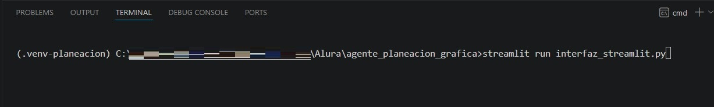

La aplicación estará disponible en:

http://localhost:8501

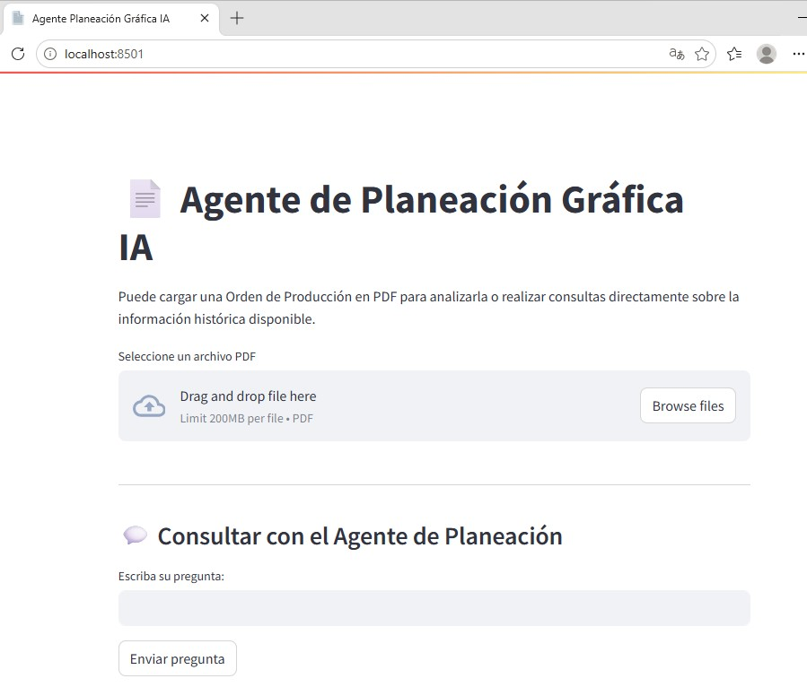

---

# 📄 Uso del sistema

## Cargar una Orden de Producción

1. Seleccionar archivo PDF.
2. Presionar:

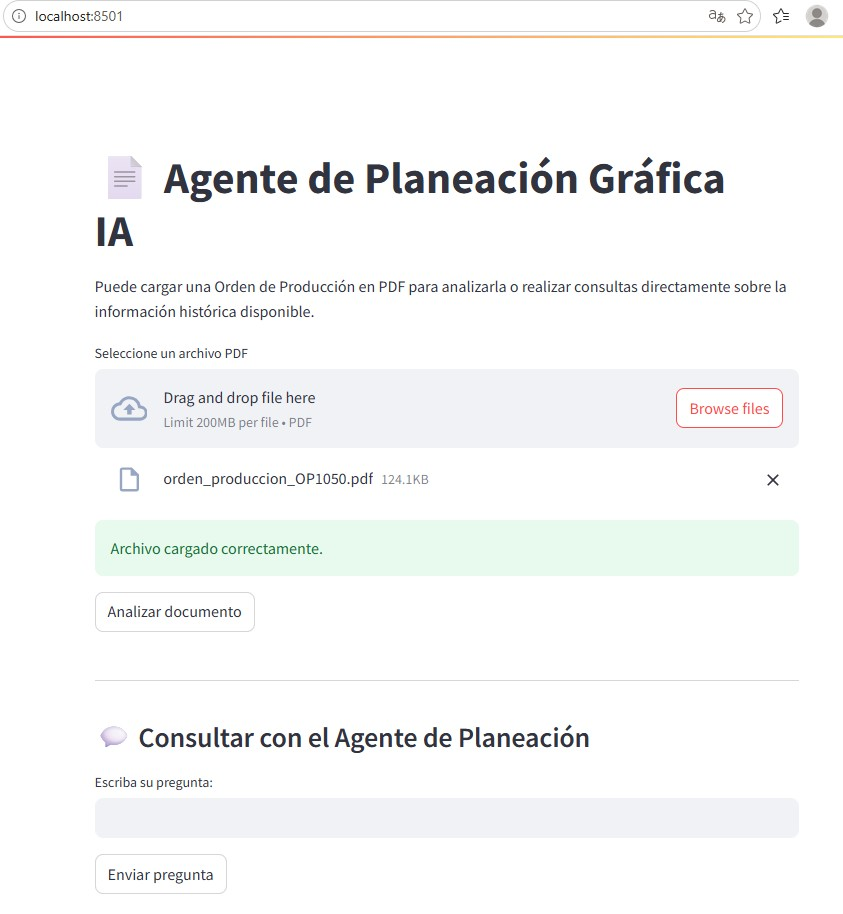

Analizar documento

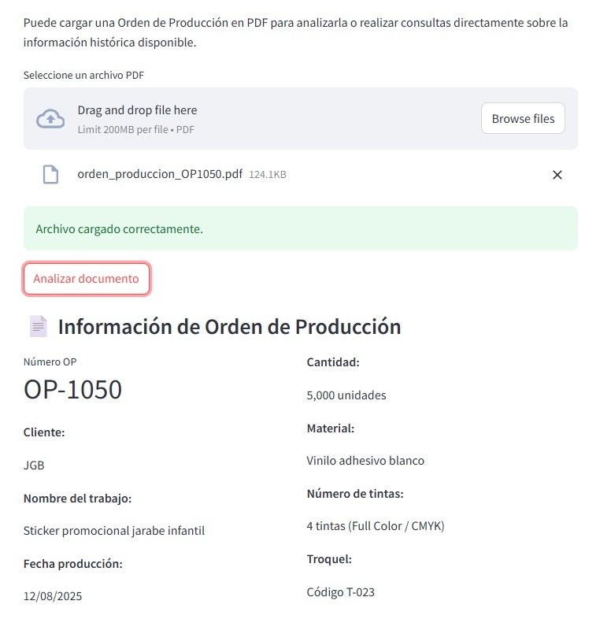

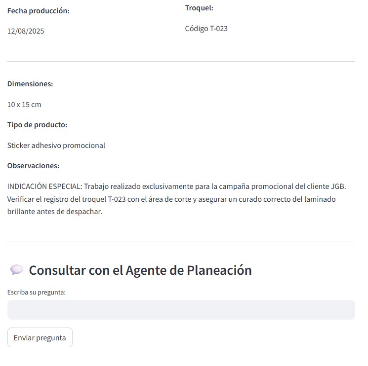

3. El agente:

- Guarda el documento.
- Extrae información.
- Genera memoria JSON.

---

# 💬 Consultas disponibles

Ejemplos:
¿Cuál es la última OP del cliente JGB?
¿Qué material utiliza la OP-1050?

Busca trabajos similares relacionados con stickers.

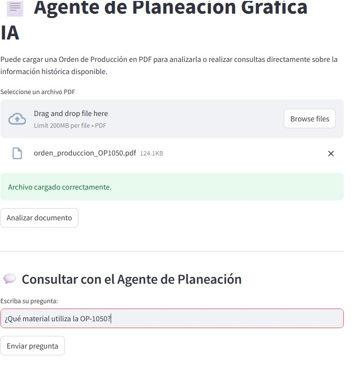

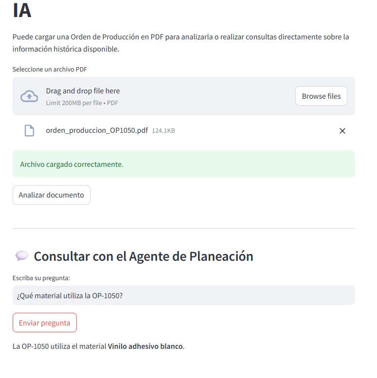

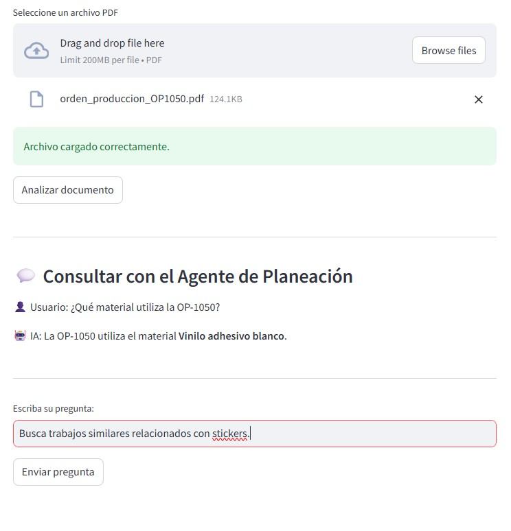

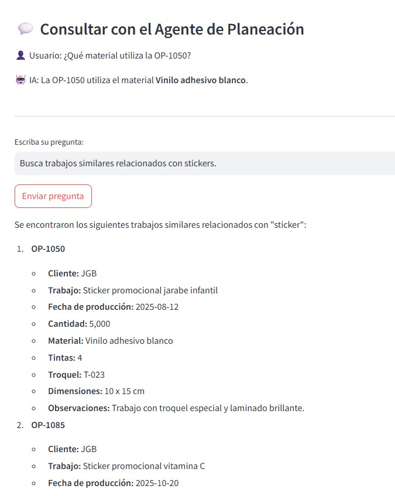

---

# 🧠 Sistema de memoria

El proyecto utiliza una memoria basada en archivos JSON.

Ejemplo:

salidas/extracciones_json/
orden_produccion_OP1050.json

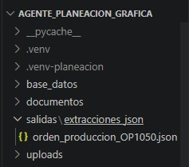


Esto permite evitar análisis repetitivos del mismo documento.

---

# 🔒 Seguridad

Los siguientes archivos no deben compartirse:

.env


porque contienen claves privadas de API.

---

# 🚀 Despliegue

El proyecto está preparado para ejecutarse en servidores Linux utilizando:

- Oracle Cloud Infrastructure.
- Ubuntu Server.
- Python virtual environment.

---

# 📌 Versión actual

v1.0-production-ready


Estado:

✅ MVP estabilizado  
✅ Análisis PDF funcional  
✅ Memoria JSON implementada  
✅ Chat conversacional operativo  
✅ Preparado para despliegue en nube

---

# ⚙️ Instalación Para Despliegue

- Tener cuenta en Oracle Cloud Infrastructure
- Crear VM

---

1. Conectar a la VM

ssh -i "RUTA/CLAVE_PRIVADA.key" ubuntu@<IP_PUBLICA_VM>

* RUTA/CLAVE_PRIVADA.key: ruta a tu archivo PEM o KEY descargado al crear la instancia en OCI.
* <IP_PUBLICA_VM>: IP pública asignada a tu VM por OCI.
* Si es la primera conexión, escribe yes cuando se pregunte por autenticidad.

---

2. Actualizar paquetes del sistema

sudo apt update && sudo apt upgrade -y

----

3. Instalar dependencias básicas

sudo apt install -y python3 python3-venv python3-pip git

---

4. Clonar el proyecto desde GitHub

git clone https://github.com/MikeMunoz-Coder/agente_planeacion_grafica/tags
cd agente_planeacion_grafica

---

5. Crear entorno virtual y activarlo

python3 -m venv .venv
source .venv/bin/activate

---

6. Instalar dependencias de Python

pip install --upgrade pip
pip install -r requirements.txtv

---

7. Configurar las variables de entorno

7.1 Crea un archivo .env en la raíz del proyecto:

nano .env

7.2 Agrega tus claves reales:

GEMINI_API_KEY=TU_API_KEY_DE_GEMINI
COHERE_API_KEY=TU_API_KEY_DE_COHERE

Guarda y cierra (Ctrl+O, Enter, Ctrl+X).

---

8. Preparar carpetas para PDFs y resultados

mkdir -p uploads/pdfs uploads/imagenes salidas/extracciones_json

Esto asegura que el proyecto pueda guardar los PDFs subidos y los archivos JSON generados.

---

9. Ejecutar la aplicación Streamlit

streamlit run interfaz_streamlit.py --server.address 0.0.0.0 --server.port 8501

--server.address 0.0.0.0 → hace que la app sea accesible desde cualquier IP.
--server.port 8501 → puerto por defecto de Streamlit.

---

10. Abrir el puerto en OCI

10.1 En Oracle Cloud, ve a Networking → Virtual Cloud Network (VCN) → Security Lists.

10.2 Agrega una Ingress Rule para permitir acceso al puerto 8501:
Protocol: TCP
Source CIDR: 0.0.0.0/0
Destination Port Range: 8501

---

11. Acceder desde el navegador

11.1 Abre:

http://<IP_PUBLICA_VM>:8501

Deberías ver la interfaz de Streamlit lista para:

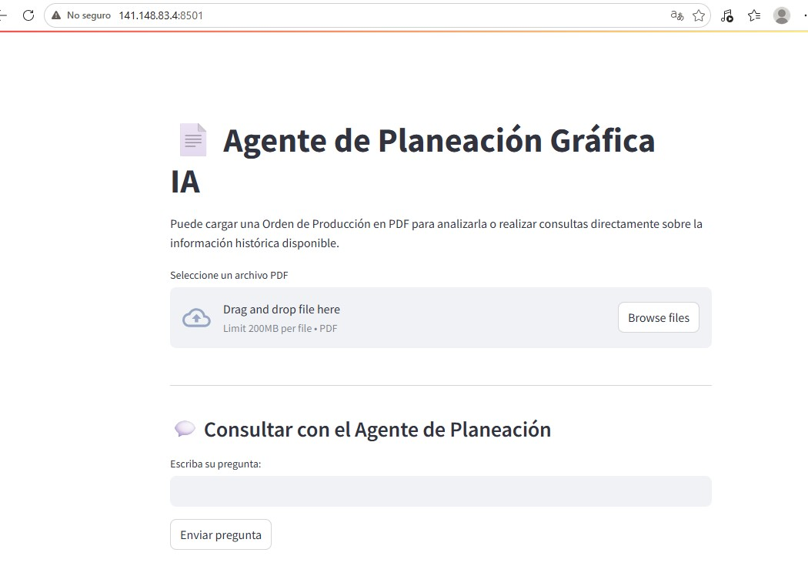

- Subir un PDF

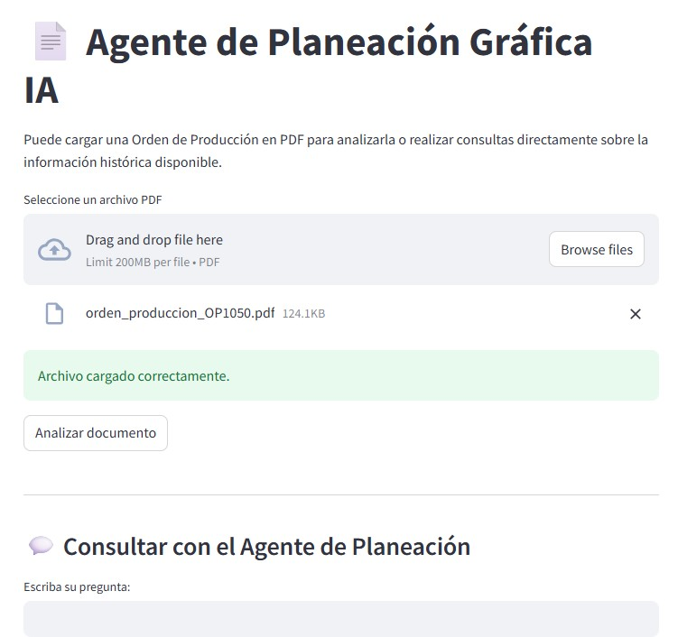


- Analizar la Orden de Producción

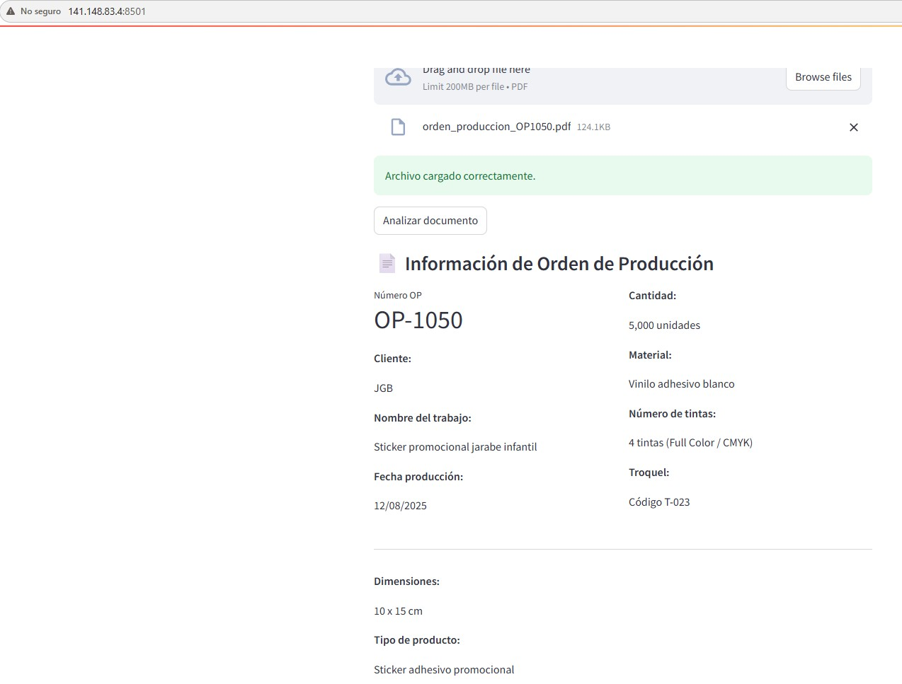
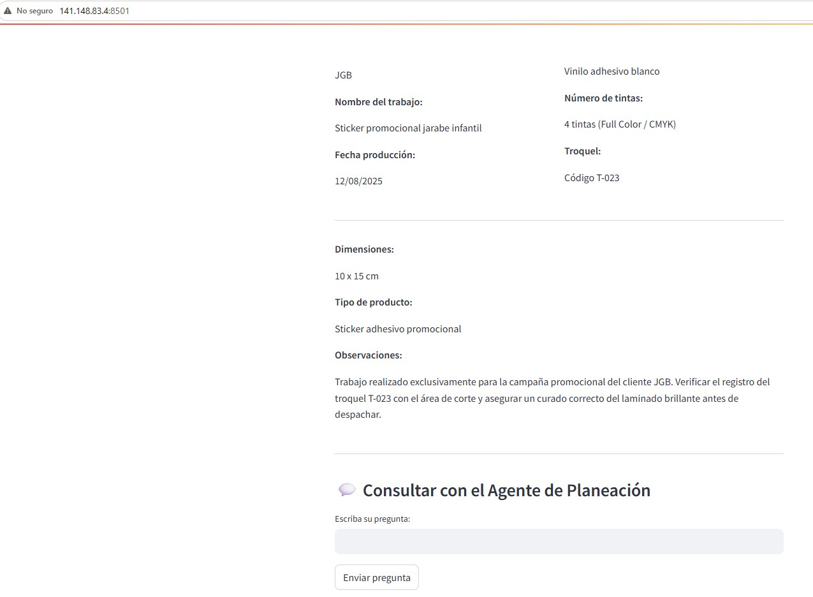

- Consultar al agente

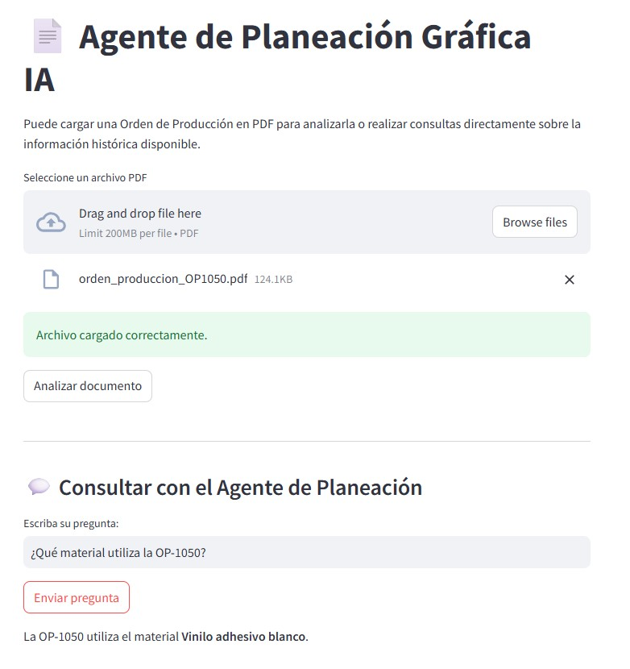
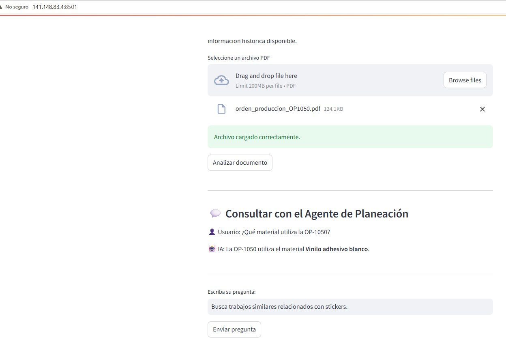


- Visualizar el historial de chat

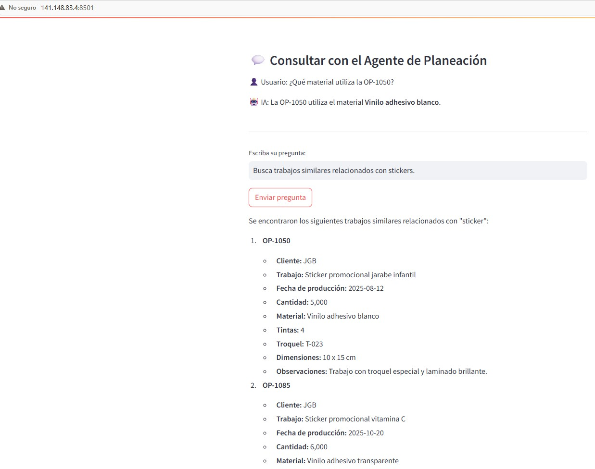
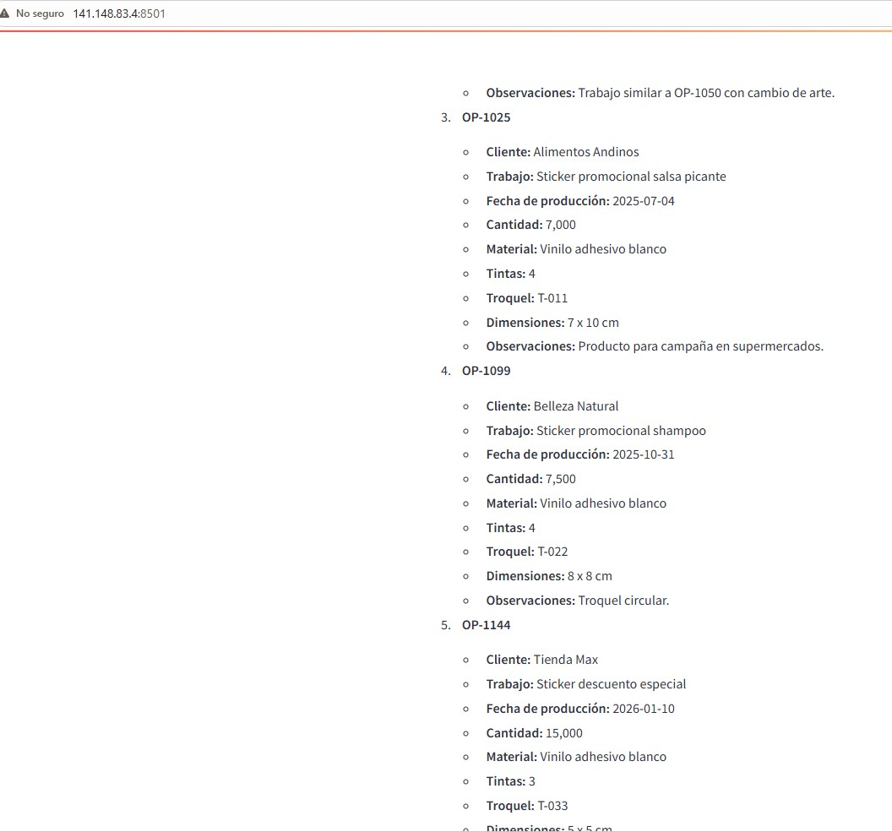

---

12. Consejos para producción

12.1 - Cómo agregar una regla de seguridad para abrir un puerto (por ejemplo, el puerto 8501 para acceder a la aplicación Streamlit):

- Accede a la página de tu cuenta de Oracle y ve a Home → Instances.
- Haz clic sobre la instancia creada.
- En Instance Details, selecciona Virtual Cloud Network (VCN).
- En la ventana del VCN, haz clic en Security.
- Selecciona Default Security List for vcn-XXXXXXXX-XXXX.
- Dentro de la ventana, haz clic en Security Rules.
- Ve a la sección Ingress Rules y haz clic en Add Ingress Rules.
- Configura la nueva regla para permitir el acceso al puerto 8501:
- Protocol: TCP
- Source CIDR: 0.0.0.0/0
- Destination Port Range: 8501
- agregar regla.

--- 

12.2 - Debes de agregar manualmente el puerto 8501 (el puerto predeterminado de Streamlit) a las iptables de tu servidor Ubuntu en Oracle Cloud y hacer que esta configuración se mantenga guardada incluso si reinicias la máquina virtual. 

1: Conectarte a tu Servidor por SSH

ssh -i "C:\Ruta_de_ubicacion_archivo\ssh-key\ssh-key-2026-07-21.key" ubuntu@tu_ip_public_de_MV

2: Agregar la Regla del Puerto 8501 a iptables

sudo iptables -I INPUT -p tcp --dport 8501 -j ACCEPT

3: Verificar que la Regla se Agregó Correctamente

sudo iptables -L INPUT -n --line-numbers | grep 8501
 
Lo que deberías ver:

1    ACCEPT     tcp  --  0.0.0.0/0            0.0.0.0/0            tcp dpt:8501

4: Guardar las Reglas de Forma Permanente (Persistencia)

sudo apt update && sudo apt install iptables-persistent netfilter-persistent -y

- Guardar las reglas actuales en el disco:

sudo netfilter-persistent save

- Confirmar que se escribió en el archivo de configuración:

grep 8501 /etc/iptables/rules.v4

Deberías ver la regla -A INPUT -p tcp -m tcp --dport 8501 -j ACCEPT dentro del archivo.

5: Probar el Funcionamiento

- Inicia tu aplicación de Streamlit dentro del directorio de tu proyecto:

streamlit run app.py --server.port 8501 --server.address 0.0.0.0

- Desde el navegador de tu computador local, abre:

[http://tu_ip_publica_de_VM:8501](http://tu_ip_publica_de_VM:8501)


# Autor

Proyecto desarrollado como sistema inteligente de apoyo a procesos de planeación gráfica mediante inteligencia artificial.

Mike Anderzon Muñoz
